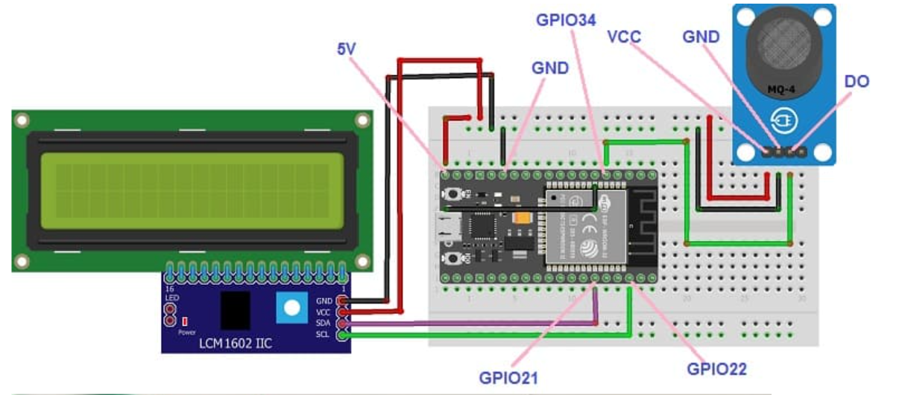

# ⛽ Gas Leakage Monitoring System using MQ4 Sensor (ESP32 + I2C LCD)

This project implements a **gas leakage monitoring system** using an MQ4 gas sensor and ESP32.
It continuously measures gas concentration and displays the value in percentage on a **16x2 LCD with I2C interface**.
The system provides **real-time monitoring** and can be extended for safety alert systems.

---

## 🎯 Objectives

* To detect methane gas using MQ4 sensor
* To display gas levels in real-time using LCD
* To interface analog sensors with ESP32
* To implement a simple gas monitoring system

---

## ⚙️ Components Used

* ESP32
* MQ4 Gas Sensor
* 16x2 LCD with I2C Module (LCM1602 I2C)
* Breadboard
* Jumper Wires

---

## 🔧 Working Principle

The gas leakage monitoring system operates by using the MQ4 gas sensor to detect the presence of methane gas in the surrounding environment. The sensor produces an analog voltage proportional to the gas concentration, which is read by the ESP32 through its analog input pin. The ESP32 processes this signal, converts it into a percentage value based on its ADC range, and continuously updates the reading. This processed data is then displayed on a 16×2 LCD using I2C communication, providing real-time information about gas levels. The system enables continuous monitoring and can be further enhanced to trigger alerts when gas concentration exceeds a predefined threshold.

---

## 🔄 System Flow

MQ4 Sensor → ESP32 → Data Processing → I2C LCD Display

---

## 💻 Arduino Code (ESP32 + I2C LCD)

```cpp id="k4m6w9"
#include <Wire.h>
#include <LiquidCrystal_I2C.h>

LiquidCrystal_I2C lcd(0x27, 16, 2); // I2C address

const int gasPin = 34;

void setup() {
  lcd.init();
  lcd.backlight();
  lcd.setCursor(0, 0);
  lcd.print("Gas Level:");
}

void loop() {
  int gasValue = analogRead(gasPin);
  int percentage = map(gasValue, 0, 4095, 0, 100);

  lcd.setCursor(0, 1);
  lcd.print("Value: ");
  lcd.print(percentage);
  lcd.print("%   ");

  delay(500);
}
```

---

## 🔌 Wiring / Circuit Connections

### ⛽ MQ4 Gas Sensor

| MQ4 Pin | ESP32 Connection |
| ------- | ---------------- |
| VCC     | 5V               |
| GND     | GND              |
| AO      | GPIO34           |
| DO      | Not used         |

---

### 📟 I2C LCD (16x2 with I2C Module)

| LCD Pin | ESP32 Connection |
| ------- | ---------------- |
| VCC     | 5V               |
| GND     | GND              |
| SDA     | GPIO21           |
| SCL     | GPIO22           |

---

## 📊 Features

* Real-time gas level monitoring
* LCD display output (I2C interface)
* Compact wiring (only 2 data lines for LCD)
* Low-cost and simple implementation

---

## ✅ Applications

* Gas leakage detection systems
* Industrial safety monitoring
* Smart home safety systems
* Environmental monitoring

---

## ⚠️ Limitations

* Not calibrated for exact gas concentration (ppm)
* No alert system (buzzer/SMS)
* Requires proper sensor calibration

---

## 🚀 Future Enhancements

* 🔊 Add buzzer alert for high gas levels
* 📱 IoT monitoring using ESP32 WiFi
* 📡 SMS/email alert system
* 🔥 Automatic ventilation control
* 📊 Cloud data logging

---

## 📸 Wiring Diagram



---

## 📚 Learning Outcomes

* ESP32 programming
* Analog sensor interfacing
* I2C communication
* LCD interfacing
* Embedded system design

---

## 📚 Conclusion

This project demonstrates an efficient gas monitoring system using ESP32 and MQ4 sensor.
By integrating an I2C LCD, it provides a compact and user-friendly interface for real-time monitoring.

---

## 👩‍💻 Author

**Farhana N S**
